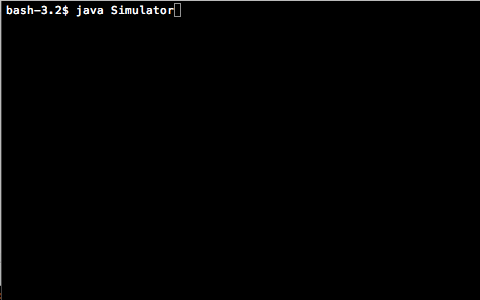

# Simulering av kassorna i ett varuhus

Den här uppgiften går ut på att simulera hur köerna växer och
krymper i ett varuhus. Genom att köra programmet med olika
parametrar (antalet kassor, ankomsthastigheten hos kunderna, vid
vilket tillfälle man öppnar nya kassor, och så vidare) kan man se
hur länge en kund behöver köa i genomsnitt under olika tider på
dygnet.

Programmet använder sig av ett antal olika klasser (dessa beskrivs
i mer detalj längre ner):

* `Customer` - En kund som har samlat på sig ett antal varor och
  nu vill betala.
* `Register` - En kassa med tillhörande kundkö. Kassa kan vara 
  öppen eller stängd.
* `Queue` - Används av `Register` för att hålla koll på vilka
  kunder som står i kön.
* `Store` - Håller koll på flera `Register`s som kunder kan ställa
  sig i kö till.
* `Simulation` - Själva simuleringen som håller koll på en `Store`
  och när det anländer nya kunder till den, samt samlar in
  statistik.
* `Simulator` - Skapar och kör en `Simulation`.

Simuleringen körs i diskreta tidssteg. Det betyder att hela
systemet rör sig ett steg per tidsenhet. På ett tidssteg händer
följande:

* Varje kund som står längst fram i en kö får en av sina varor
  registrerad i kassan.
* Varje kund som står längst fram i en kö och inte har några varor
  kvar att registrera lämnar varuhuset.
* Om en ny kund har handlat klart (detta styrs av slumpen) går
  denne och ställer sig i en kö.
* Om snittkölängden är för lång öppnas en ny kassa (om det finns
  någon mer kassa att öppna).
* All relevant statistik om det nuvarande tidssteget samlas in.

Vi kan hålla koll på "vad klockan är" genom att se hur många
tidssteg som har gått sedan vi startade simuleringen. Varje objekt
håller själv reda på vad just det objektet ska göra när det går
ett tidssteg.

Genom att skriva ut en grafisk representation av systemet varje
tidssteg kan man få en animation av hur kunderna kommer och går.
Ett förslag på hur det kan se ut är så här:




## Klassen `Customer`

En kund i vårt system behöver hålla koll på hur många varor hen
har i sin korg samt vid vilken tidpunkt hen kom in i systemet.
Följande attribut borde räcka:

* `int bornTime` - Tidssteget som kunden kom in i systemet
* `int groceries` - Antalet varor i kundens korg

Förutom en konstruktor behövs (åtminstone) följande metoder:

* `serve()` - Registrera en av kundens varor (alltså minska på
  `groceries`)
* `isDone()` - Fråga om kunden är färdig, dvs. om `groceries` är
  `0`.

En kund behöver inte vara medveten om att tiden går (`bornTime`
och `groceries` påverkas ju inte av tiden).

## Klassen `Register`

En kassa måste veta om den är öppen eller stängd, samt hålla koll
på kunderna som står i kö:

* `boolean open` - `true` om kassan är öppen
* `Queue queue` - En kö av kunderna som väntar på att behandlas.
  Kunden som står längst fram i kön är den som får sina varor
  behandlade.

Förutom en konstruktor behövs (åtminstone) följande metoder:

* `open()` - Öppna kassan.
* `close()` - Stäng kassan.
* `isOpen()` - Är kassan öppen?
* `step()` - Låt tiden gå ett steg i kassan. Det betyder att
  kunden som står först i kön får en vara registrerad.
* `hasCustomers()` - Har kassan några kunder?
* `currentCustomerIsDone()` - Är kunden som står längst fram i kön
  klar?
* `addToQueue(Customer c)` - Ställ kunden `c` sist i kön.
* `removeCurrentCustomer()` - Ta bort (och returnera) kunden som
  står först i kön.
* `getQueueLength()` - Hur lång är kön?.


Notera att många av metoderna är lätta att implementera med hjälp
av metoderna i klassen `Queue`!

## Klassen `Queue`

En kö ser ut ungefär som en länkad lista, med skillnaden att man
alltid lägger till element i ena änden och tar bort element i den
andra. Precis som en länkad lista består en kö ett antal noder
(nedan kallad `Node`, som med fördel kan ligga nästlad i `Queue`).
En nod ser ut precis som länken i en länkad lista:

* `Customer element` - Kunden som står på just den platsen i kön
* `Node next` - Noden för platsen bakom den nuvarande.

I klassen `Queue` behövs referenser till första och sista noden i
kön:

* `Node first` - Noden som håller det första elementet
* `Node last` - Noden som håller det sista elementet
* `int length` - Antalet kunder i kön just nu (frivilligt, men
  praktiskt att ha)

Förutom en konstruktor behövs (åtminstone) följande metoder:

* `length()` - Hur lång är kön?
* `enqueue(Customer c)` - Ställ en kund sist i kön
* `dequeue()` - Ta bort (och returnera) kunden som står först i
  kön.
* `first()` - Returnera (men ta inte bort) kunden som står först i
  kön.

## Klassen `Store`

Eftersom vi bara är intresserade av kassorna representeras själva
varuhuset bara av en array av kassor:

* `Register registers[]` - Kassorna i varuhuset

Konstruktorn kan med fördel ta antalet kassor som argument, och
bör öppna minst en av sina kassor. Förutom en konstruktor behövs
(åtminstone) följande metoder:

* `getAverageQueueLength()` - Vad är snittlängden för alla kassor
  i varuhuset?
* `newCustomer(Customer c)` - Ställ kunden `c` i den kortaste kön.
* `step()` - Tiden går ett steg i varuhuset.
* `openNewRegister()` - Öppna en ny kassa (om det går).
* `getDoneCustomers()` - Returnera alla kunder som är klara i det
  nuvarande tidssteget.

## Klassen `Simulation`

Det här är klassen som håller koll på tiden och all statistik, och
avgör när det kommer nya kunder och när det är dags att öppna nya
kassor. Det är också den här klassen som tar emot simuleringens alla
parametrar. Följande attribut är en bra början:

* `Store store` - Varuhuset som simuleras
* `int time` - Antalet tidssteg sedan simuleringen startade
* `int intensity` - Sannolikheten (i procent) att det ska komma en
  ny kund vid varje tidssteg.
* `int maxGroceries` - Maxantalet varor som en kund kan ha när hen
  kommer till kassan.
* `int thresholdForNewRegister` - Vid vilken snittlängd en ny
  kassa öppnas.

Det kan också vara en bra idé att ha attribut för den statistik
man samlar.

Förutom en konstruktor behövs nästan bara metoden `step()` som
driver simuleringen framåt ett tidssteg. Detta bör ske i följande
steg:

1. Låt tiden gå ett steg i varuhuset.
2. Slumpa ett heltal mellan `0` och `100` om heltalet är mindre
   än `intensity`, skapa en ny kund och skicka den till
   varuhuset. Antalet varor i kundens korg slumpas fram mellan
   `1` och `maxGroceries`.
3. Hämta snittlängden på kassaköerna i varuhuset. Om den är
   högre än `thresholdForNewRegister`, öppna en ny kassa.
4. Hämta alla kunder som är klara och samla in statistik från
   dem.

Du bör också ha metoder för att returnera den insamlade
statistiken.

## Klassen `Simulator`

`Simulator` är given och innehåller bara programmets `main`-metod
som skapar en ny `Simulation` och anropar `step` på den ett visst
antal gånger. Mellan varje tidssteg skrivs simuleringen ut och
tråden som kör pausas i en halv sekund.

Det går förstås bra att ändra i `Simulator` om man vill, till
exempel genom att låta programmet läsa in parametrar från en fil
eller från kommandoradsargumenten.

## Föreslagen arbetsgång

Jobba [bottom-up](/forelasningar/L10/) och börja med den minsta
klassen.

1. Börja med att rita! Vilka klasser finns det? Hur hänger de samman,
   dvs. vilka funktioner fyller de för varandra? (Dvs. vilka metoder
   kommer klass X att använda hos klass Y, etc.) Fundera också över
   skillnaden mellan klasser och objekt (instanser av klasser) -- 
   det finns en kö-klass, men hur många köer finns det? 

1. **Nu är det dags att börja implementera!** Börja med att 
   skriva klassen `Customer`. Skriv ett enkelt
   program som testar att kund-klassen fungerar som den ska. Till
   exempel: skapa en kund med tre varor, anropa `serve` tre gånger
   och kontrollera att kunden är klar (med `isDone`). Ett förslag
   finns i [CustomerTest.java](CustomerTest.java).

2. Den enda klassen du kan skriva härnäst är `Queue` (`Register`
   är beroende av `Queue`, `Store` är beroende av `Register`,
   `Simulation` är beroende av `Store`...). *Börja med* att skriva
   ett enkelt testprogram (som bara har en `main`-metod) som
   skapar en kö och några kunder, ställer kunderna i kön, plockar
   ut dem och kontrollerar att de kommer ut i rätt ordning.

   Själva klassen `Queue` är som sagt beroende av att det finns en
   klass för köns noder. Den kan med fördel vara definierad som en
   (privat) klass inuti klassen `Queue`. Du väljer själv om du
   vill ha `get`- och `set`-metoder för nodernas attribut eller om
   du vill komma åt dem direkt (jämför `this.first.getNext()` och
   `this.first.next`).

   Ett specialfall att tänka på är vad som händer om man försöker
   ta bort en kund ur en kö som redan är tom. Om detta händer är
   något förmodligen fel i programmet, så det är ett bra tillfälle
   att kasta ett undantag. Du kan skapa en klass för eget undantag
   på följande vis

   ```java
   public class EmptyQueueException extends RuntimeException{}
   ```

   och sen kasta undantaget genom att skriva `throw new
   EmptyQueueException()`.

3. Nästa klass att skriva är `Register`. Precis som tidigare kan
   du testa den här klassen separat genom att skapa en kassa och
   några kunder, låta tiden gå några steg och kontrollera att
   kunderna behandlas som de ska. Notera att metoden `step` bara
   behandlar den första kunden. Det är `Store`s ansvar att plocka
   ut kunden när hen är klar.

4. När kassaklassen är klar kan du skriva `Store`, som ju består
   av en samling kassor i en array. Många av metoderna går ut på
   att iterera över alla kassor och göra något särskilt. I Java
   kan du använda `for`-loopar för att iterera över en samling:

   ```java
   for(Register r : this.registers) {
       ...
    }
   ```

   Loopen ovan kommer att iterera över hela `this.registers` och i
   varje steg av loopen binda `r` till en av kassorna i arrayen.

   Metoden `getDoneCustomers` ska returnera en samling av kunder.
   Du kan använda en array, din egen `Queue` eller någon
   datastruktur från Javas standardbibliotek.

   Det lättaste sättet att testa klassen är förmodligen att skapa
   en `Store`, lägga in ett par kunder med kända parametrar och
   anropa `step` och `getDoneCustomers` för att kontrollera att
   kunderna behandlas som de ska. Om något inte verkar funka kan
   du skriva ut hela varuhuset mellan varje steg för att se hur
   kunderna rör sig. Det är också en bra förberedelse för det
   sista steget:

5. Sist kan du skriva klassen `Simulation`. Den viktigaste metoden
   är `step`, som beskrevs i mer detalj tidigare. Du kommer att
   behöva slumpa fram några tal. För att göra det kan du låta
   klassen ha följande attribut:

   ```java
   Random random = new Random();
   ```

   Du måste importera `java.util.Random` för att den klassen ska
   hittas. När du har ett `Random`-objekt på det sättet kan du
   anropa `random.nextInt(100)` för att slumpa fram ett heltal
   mellan `0` och `100`.

   Du kan välja själv mellan att ha flera metoder som alla
   returnerar varsin bit av statistiken, eller om du vill skapa en
   klass som lagrar all statistik och ha en metod som returnerar
   ett sådant objekt.

## Fler tips

* Använd privata metoder när du fuskar inom en klass. Till
  exempel, när du lägger till en ny kund i `Store` behöver du
  hitta den kortaste kön. Låtsas att det finns en metod som gör
  det åt dig, och implementera den senare!

* Använd klassernas `toString`-metoder för att "rita upp"
  systemet. En kund kan skrivas ut som `[n]`, där `n` är antalet
  varor i kundens korg. En kassa kan skrivas ut som `X [ ]` när
  den är stängd, och som `[n]@@@` när den är öppen och det finns
  fyra kunder i kö. Den första kundens strängrepresentation får vi
  genom att anropa `toString` på den första kunden. Resterande
  kunder är bara `length() - 1` stycken `@`. Ett varuhus kan
  skrivas ut genom att skriva ut varje kassa en rad i taget. En
  simulering kan skrivas ut genom att skriva ut varuhuset
  tillsammans med den insamlade statistiken.

* Ett enkelt sätt att kontinuerligt mäta snittväntetiden är att
  istället mäta antalet färdiga kunder och deras sammanlagda
  väntetid. Då får man fram snittväntetiden genom att dela den
  sammanlagda väntetiden med antalet färdiga kunder.

## Förslag på utökningar

* Gör programmet lättare att testa genom att läsa parametrarna
  från kommandoraden eller från en fil, så att du inte behöver
  kompilera om för att köra med olika värden. Läs till exempel på
  om
  [Properties](https://docs.oracle.com/javase/tutorial/essential/environment/properties.html).

* Kö-strukturen som beskrivs ovan går att göra generell så att den
  inte bara kan lagra kunder. Gör klassen *parametriskt polymorf*,
  så att en kö av kunder istället skrivs som `Queue<Customer>`.

* När det öppnar en ny kassa, låt kunder som står i en lång kö
  flytta över till den nya kassan (men bara om det innebär att de
  får en bättre plats än den de redan har). Detta kommer
  förmodligen kräva att du implementerar en metod i `Queue` för
  att returnera "svansen" av en kö.

* Ett sätt att få in arv i uppgiften är att låta det finnas flera
  olika sorters kunder, till exempel pensionärer som tar dubbelt
  så lång tid på sig i kassan eller storfamiljer som kör med
  självscanning och därför alltid blir klara på ett enda tidssteg.

* Du kan låta kunderna välja kö själva genom att skriva en metod
  `chooseQueue(Register registers[])` som returnerar den kassa i
  `registers` som kunden vill bli ställd i. Du kan låta olika
  kunder ha olika strategi, till exempel att välja den kortaste
  kön eller kön med minst antal varor totalt. Detta kan kräva att
  du behöver något sätt att iterera över en kö. Se till exempel
  interfacet
  [Iterable](http://docs.oracle.com/javase/8/docs/api/java/lang/Iterable.html)
  och hur det samspelar med `for`-loopar!

## Rekommenderade mål på nivå tre

1. [Inluppsmål 4](http://auportal.herokuapp.com/achievements/103)
2. [A2](http://auportal.herokuapp.com/achievements/2) - Fundera på
   vad varje klass behöver veta om de andra klasserna de använder.
   Hur hade du skrivit motsvarande kod i C?
3. [G16](http://auportal.herokuapp.com/achievements/16) - Vilka
   attribut (om några) ska vara synliga utifrån? Jämför att ha
   privata attribut med getters och setters med att bara ha
   publika attribut.
4. [I23](http://auportal.herokuapp.com/achievements/23) - Vad
   händer när man försöker plocka ut något ur en tom kö? Vem (om
   någon) ska ta hand om problemet? Vad händer om vi behöver öppna
   en ny kassa när det inte finns någon mer kassa att öppna? Hur
   meddelar vi det till omvärlden när typen på `step` är void?
5. [N40](http://auportal.herokuapp.com/achievements/40) - Vad
   händer när vi kompilerar vårt program? Vilka filer skapas? Vad
   händer om man byter ut någon av filerna och kör programmet? Hur
   skulle motsvarande program (med samma modularisering) fungera i
   C?

## Rekommenderade mål på nivå fyra/fem
1. [E12](http://auportal.herokuapp.com/achievements/12) - Om du
   gör `Queue` generell.
2. [G17](http://auportal.herokuapp.com/achievements/17) - Om du
   kapslar in klassen noderna i `Queue`.
3. [I25](http://auportal.herokuapp.com/achievements/25) - Se punkt
   **4** ovan.
4. [J28](http://auportal.herokuapp.com/achievements/28) - När
   frigörs kund-objekten i programmet?
